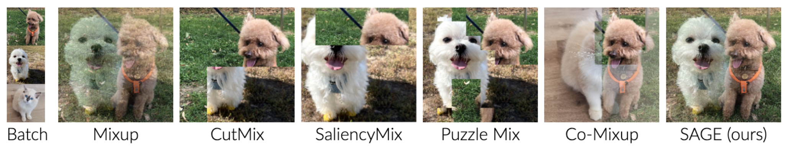

# SAGE: Saliency-Guided Mixup with Optimal Rearrangements
This is the official PyTorch implementation of "SAGE: Saliency-Guided Mixup with Optimal Rearrangements" accepted at BMVC'20 ([paper](https://arxiv.org/abs/2211.00113), [talk](https://bmvc2022.mpi-inf.mpg.de/0484_video.mp4), [poster](https://bmvc2022.mpi-inf.mpg.de/0484_poster.pdf)). Some parts of the codes are borrowed from Puzzle Mix ([link](https://github.com/snu-mllab/PuzzleMix)).  
We also provide implementations for training with mixup and its variants, in particular the ones that leverage input saliency in the data augmentation process: [Mixup](https://arxiv.org/abs/1710.09412), [SaliencyMix](https://arxiv.org/abs/2006.01791), [Manifold Mixup](https://arxiv.org/abs/1806.05236), [CutMix](https://arxiv.org/abs/1905.04899), [Puzzle Mix](https://arxiv.org/abs/2009.06962) and [Co-Mixup](https://openreview.net/forum?id=gvxJzw8kW4b).




## Citing this Work 
```
@inproceedings{ma2022sage,
    title= {SAGE: Saliency-Guided Mixup with Optimal Rearrangements},
    author = {Ma, Avery and Dvornik, Nikita and Zhang, Ran and Pishdad, Leila and Derpanis, Konstantinos G and Fazly, Afsaneh},
    booktitle = {British Machine Vision Conference (BMVC)},
    year = {2022}
}
```

## Requirements
This code has been tested with  
python 3.9.7 
pytorch 1.10.1
cudnn 7605
torchvision 0.11.2 
gco-wrapper (https://github.com/Borda/pyGCO)

matplotlib 2.1.0  
numpy 1.21.2  
six 1.12.0  

## Reproducing SAGE
Dataset will be downloaded at ```[data_path]``` and the results will be saved at ```[save_path]```. If you want to run codes without saving results, please set ```--log_off True```.

### CIFAR-10
- To reproduce **SAGE with PreActResNet18 for 300 epochs**, run:
```
python3 main.py --dataset cifar10 --data_dir [data_path] --root_dir [save_path] --labels_per_class 5000 --arch preactresnet18  --learning_rate 0.2 --momentum 0.9 --decay 0.0001 --epochs 300 --schedule 100 200 --gammas 0.1 0.1 --method sage --blur_sigma 1.0 --seed 1 --kernel_size 5 --ngpu 1 --workers 2 --mixup_alpha 1.0 --upper_lambda 0.6 --rand_pos 0.01 --update_ratio 0.7
```
### CIFAR-100
- To reproduce **SAGE with PreActResNet18 for 300 epochs**, run:
```
python3 main.py --dataset cifar100 --data_dir [data_path] --root_dir [save_path] --labels_per_class 500 --arch preactresnet18  --learning_rate 0.2 --momentum 0.9 --decay 0.0001 --epochs 300 --schedule 100 200 --gammas 0.1 0.1 --method sage --blur_sigma 1.0 --seed 1 --kernel_size 5 --ngpu 1 --workers 2 --mixup_alpha 1.0 --upper_lambda 0.5 --rand_pos 0.01 --update_ratio 0.7
```
- To reproduce **SAGE with ResNext29-4-24 for 300 epochs**, run:
```
python3 main.py --dataset cifar100 --data_dir [data_path] --root_dir [save_path] --labels_per_class 500 --arch resnext29_4_24 --learning_rate 0.2 --momentum 0.9 --decay 0.0001 --epochs 300 --schedule 100 200 --gammas 0.1 0.1 --method sage --blur_sigma 1.0 --seed 1 --kernel_size 5 --ngpu 1 --workers 2 --mixup_alpha 1.0 --upper_lambda 0.7 --rand_pos 0.01 --update_ratio 0.5
```
- To reproduce **SAGE with WideResNet16-8 for 300 epochs**, run:
```
python3 main.py --dataset cifar100 --data_dir [data_path] --root_dir [save_path] --labels_per_class 500 --arch wrn16_8 --learning_rate 0.2 --momentum 0.9 --decay 0.0001 --epochs 300 --schedule 100 200 --gammas 0.1 0.1 --method sage --blur_sigma 1.0 --seed 1 --kernel_size 5 --ngpu 1 --workers 2 --mixup_alpha 1.0 --upper_lambda 0.7 --rand_pos 0.01 --update_ratio 0.5
```

## Reproducing baselines
We follow the hyper-parameter configurations described in Co-Mixup to reproduce the baseline results, simply replace [baseline_method] with ```vanilla```, ```saliencymix```, ```input```, ```manifold```, ```cutmix```, ```puzzle``` and ```comix```.
Options of ```arch```: ```preactresnet18```, ```resnext29_4_24``` and ```wrn16_8```.

### CIFAR-10
```
python3 main.py --dataset cifar10 --data_dir [data_path] --root_dir [save_path] --labels_per_class 5000 --arch [arch] --learning_rate 0.2 --momentum 0.9 --decay 0.0001 --epochs 300 --schedule 100 200 --gammas 0.1 0.1 --method [baseline_method] 
```

### CIFAR-100
```
python3 main.py --dataset cifar100 --data_dir [data_path] --root_dir [save_path] --labels_per_class 500 --arch [arch] --learning_rate 0.2 --momentum 0.9 --decay 0.0001 --epochs 300 --schedule 100 200 --gammas 0.1 0.1 --method [baseline_method] 
```

## License
MIT License

